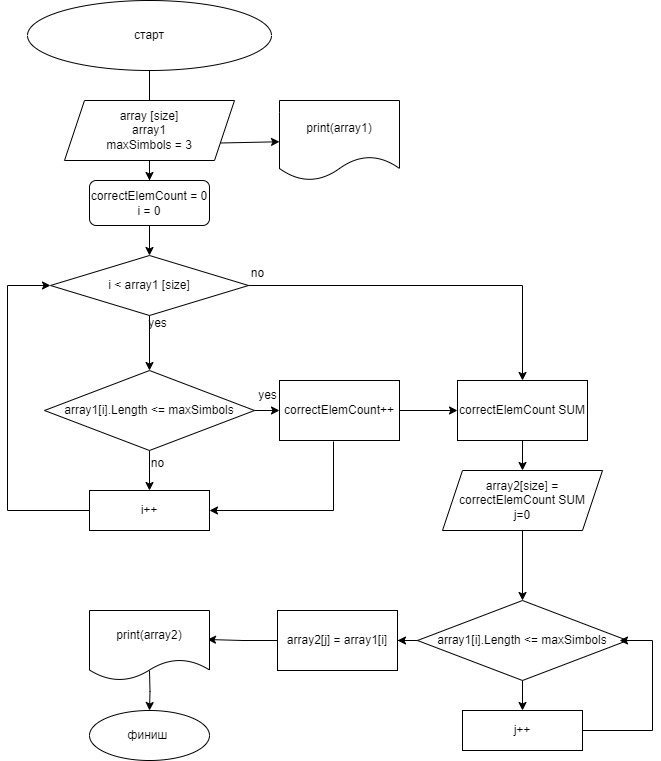

### Выводим запрос на ввод количества элементов массива(size).

Задаем массив **array1** размером ***size***.
Задаем переменную ***i*** (индекс элемента массива **array1**).

### Пользователь заполняет массив с клавиатуры.
### Выводим на экран полученный массив **array1**.

Вводим переменную ***maxSymbols*** (макс. допустимое количество знаков в элементе). По условию, 
```
maxSymbols = 3
``````

Вводим счетчик ***correctElemCount*** кол-ва элементов, подходящих под условие 
```
(array[i] <= maxSymbols).
```

Проверяем элементы массива **array1** на соответствие условию с одновременным подсчётом количества соответствующих элементов

Задаём массив **array2** размером? равным *correctElemCount*.

Задаём переменную ***j*** (индекс элемента массива **array2**)

Заполняем новый массив **array2** через повторную проверку каждого элемента массива **array1** на длину элемента 
```
array1[i] <= maxSymbols
```
(при соответствии условию, присваиваем значение элемента **array1[i]** текущему элементу **array2[j]** и записываем его в массив **array2**). 

### Выводим полученный массив **array2* на экран.

### Алгоритм решения таков


